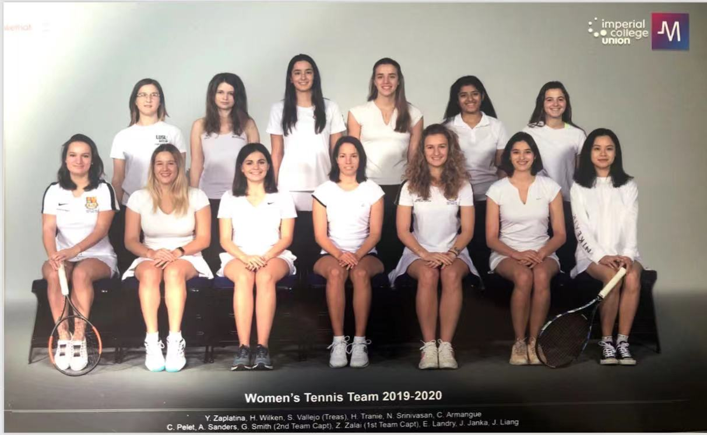
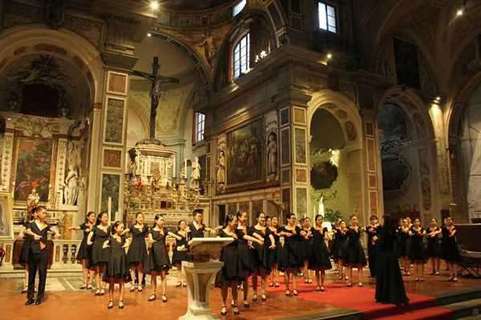

# Extracurricular

## Tennis 

I started playing tennis at the age of 10, and now I am a tennis team member at Imperial College, we often play against other universities. I also play socially at weekends with my friends, I can play both singles and doubles. Playing tennis help to enhance abilities of planning and tactical thinking.  My favourite tennis player is Roger Federer.

 

## Music 

I started learning Bel Canto at the age of 12, and joining in one of the famous choir in China. The choir was invited to Italy to participate in the 5th Florence International Choir Festival, and won the championship in the contemporary music category of the event. 

 

## National Citizen Service

The National Citizen Service is a voluntary personal and social development programme, funded largely by the UK Government. I took part in NCS at the age of 16. Week one was the adventure week, I tried some new sport, like surfing and rafting. In the second week, I picked up a bunch of skills by attending workshops and lectures. For the following week, we worked together as a team to raise awareness for homeless people, and provided physical help for them.
 
