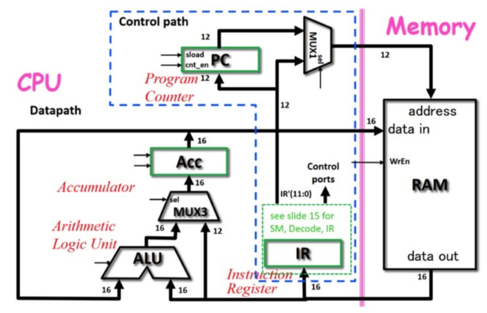

# Project

## MUO Design 

**<small>2020.01 - 2020.04 <small>**

This project was coursework from Digital and Computer Architecture course at Imperial College. I designed the control path and data path of a MU0 microprocessor, it was a register transfer level design, so I used Verilog to describe the data transmission between blocks. I started with control path first and then the data path. In control path, there were several major blocks eg. program counter, memory unit, instruction register and a decoder. In data path, the major blocks were arithmetic logic unit block, a multiplexer and an accumulator.

## Analog Music Synthesiser 

**<small>2020.05 - 2020.07 <small>**

This project was my end of year project in first year at Imperial College. The aim of this project was to design a circuit for an analogue music synthesiser that can generate audio frequency tons for 7 notes in the C major, and simulated it using LTSpice. I broke down the sythesiser into 6 main blocks (eg. VCO, VCF, ADSR), and design each block completely from scratch. The report can be found [here](https://github.com/jl3419-ljy/jl3419-ljy/blob/main/AnalogMusicSynthesiserReport.docx).

## Mars Rover 

**<small>2021.05 - 2021.07 <small>**

This project was my end of year project in second year at Imperial College. The aim of this project is to build a Mars Rover that could be used in remote location without supervision. The rover is composed of five subsystems, including command, control, vision, drive and energy subsystems, and each part is capable of different functionality. With the collaboration of these subsystems, the rover can operate in two modes. The command controlled mode and self driving mode. The report can be found [here](https://github.com/jl3419-ljy/jl3419-ljy/blob/main/MarsRoverReport.pdf).

## Digital System Design 

**<small>2022.01 - 2022.04 <small>**

This project was coursework from digital system design course at Imperial College. The main objective of this project is to create a digital system to evaluate certain function, in my case it is a cosine function. I used an altera FPGA with a NIOS II processor, the NIOS II processor is programmed by writing C on eclipse. In order to accelerate the cosine function, I implemented a custom CORDIC IP, and DMA is used to access data from memory directly. 

## Iris Air 

**<small>2022.01 - 2022.04 <small>**

This project was coursework from embedded system course at Imperial College. Iris Air is a smart device that measures temperature, humidity, light colour and intenisty, it then analyses and visualises the data on an easy to use, widely compatible website. The device uses a machine learning model combined with data from your working sessions and your feedback to provide real-time suggestions on how to optimise your work environment. The website can be found [here](https://bt2194.wixsite.com/my-site-1). 

## Music Synthesiser (Creme de la Creme)  

**<small>2022.01 - 2022.04 <small>**

This project was coursework from embedded system course at Imperial College. The main objective of the project is to write embedded software to make the music synthesiser work! We not only implemented the core features of the synthesiser, but also added some advanced feature such as polyphony, different types of waveforms and echo.

## Hardware Accelerated ML for Embedded Devices

**<small>2022.04 - 2022.07 <small>**

This project was my end of year project in third year at Imperial College. This project aims to introduce an extension to the Tensorflow library to use hardware accelerators defined on FPGAs using the PYNQ framework from Xilinx. The intention here is that we are proposing the use of FPGAs to allow any accelerator to be loaded onto our embedded device and cater towards application specific needs. The sourcecode and report can be found [here](https://github.com/jl3419-ljy/FPGA-Consultancy) 

